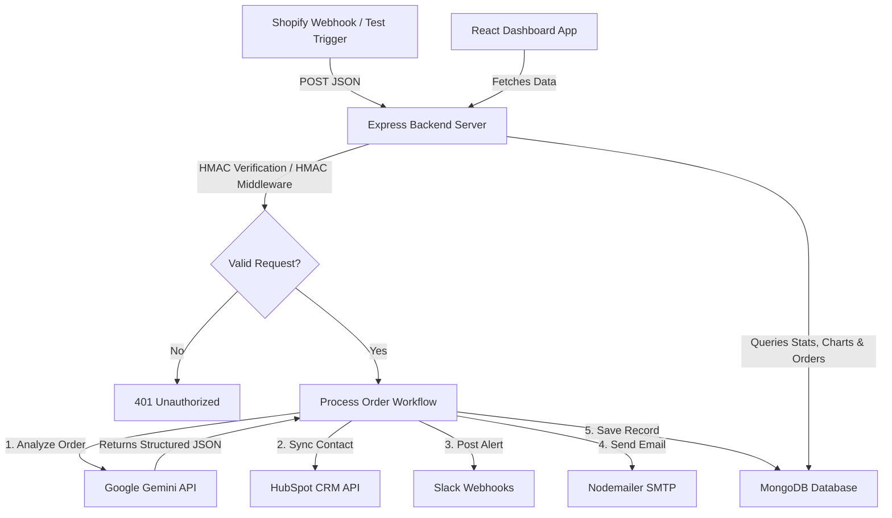

# OrderPulse 🚀
### E-Commerce Webhook Automation & AI Analyst Dashboard

**OrderPulse** is a modern full-stack application designed to capture real-time order webhooks (e.g., from Shopify), perform intelligent classification using **Google Gemini AI**, and automatically route data and alerts across multiple platforms: **MongoDB**, **HubSpot CRM**, **Slack**, and **Email**. It includes a premium React-based dashboard for store managers to monitor order analytics, fraud alerts, and customer classifications.

---

## 🏗️ System Architecture

The following diagram illustrates the flow of an order from the moment it is placed to when it is processed, saved, and dispatched to third-party services:



---

## ⚡ Key Features & Workflows

### 1. Shopify Webhook Receiver & Security
- **Endpoints**: `/api/webhook/shopify` (with HMAC validation) and `/api/webhook/test` (for debugging).
- **HMAC Verification**: A security middleware validates Shopify's custom signature (`X-Shopify-Hmac-Sha256`) using the raw request body and a shared webhook secret, ensuring only genuine Shopify requests are processed.

### 2. Google Gemini AI Analysis
- **Model**: `gemini-2.5-flash` via HTTP POST.
- **Process**: The system feeds the raw order details alongside a specialized e-commerce persona prompt.
- **Output**: Returns a strict JSON response containing:
  - `classification`: `'VIP'` (high spend/value), `'risky'` (suspicious addresses/first-time high orders), or `'new'` (general status).
  - `summary`: A concise 2-sentence summary of the order contents.
  - `reason`: A single sentence justifying the classification.
  - `fraud_hints`: Array of detected anomalies (e.g., mismatched billing/shipping addresses, random chars in email).

### 3. HubSpot CRM Integration
- **Search & Upsert**: The backend searches for an existing contact in HubSpot using the customer's email.
  - **If exists**: Updates their `customer_classification` and logs the `last_order_tag` (e.g., `Order #123456789`).
  - **If new**: Creates a new contact entry with their full name and matching properties.

### 4. Slack & Email Multi-Channel Alerts
- **Slack Block Kit**: Sends rich markdown-formatted cards containing order details, classification badges (👑 VIP, ⚠️ Risky, 🆕 New), and the AI summary directly to a Slack channel.
- **Nodemailer SMTP**: Automatically compiles an HTML alert and emails the shop administrator for any high-priority (`VIP` or `risky`) orders.

### 5. MongoDB Analytics Schema
- Persists all orders using Mongoose schemas.
- Stores order details, totals, item structures, HubSpot contact IDs, and AI-determined fields (`classification`, `aiSummary`, `fraudHints`) for instant dashboard loading.

### 6. React Analytics Dashboard
- **StatsCards**: Displays live metrics (Total Orders, Total Revenue, Average Order Value, and counts by category).
- **OrderTable**: Provides a paginated list of recent orders with search functionality, classification badges, and a toggle to expand and read the Gemini AI-generated order summaries.
- **OrderChart**: Visualizes order trends and classifications over a rolling 14-day window.

---

## 🛠️ Tech Stack

| Layer | Technologies |
|---|---|
| **Frontend** | React, Vite, ES6 Javascript, Vanilla CSS |
| **Backend** | Node.js, Express, Dotenv, Node-Fetch, Nodemailer |
| **Database** | MongoDB Atlas, Mongoose |
| **Generative AI** | Google Gemini API (`gemini-2.5-flash`) |
| **Integrations** | HubSpot CRM, Slack (Incoming Webhooks), Shopify Webhooks |

---

## ⚙️ Environment Configuration

The backend runs on port `3001` and is configured via standard environment variables:

```ini
PORT=3001
MONGODB_URI=mongodb+srv://...
SHOPIFY_WEBHOOK_SECRET=shpss_...
GEMINI_API_KEY=AIzaSy...
HUBSPOT_API_KEY=pat-...
SLACK_WEBHOOK_URL=https://hooks.slack.com/services/...
EMAIL_USER=admin@example.com
EMAIL_PASS=smtp_app_password
EMAIL_TO=alerts@example.com
FRONTEND_URL=http://localhost:5173
```

---

## 🚀 How to Run the Project

1. **Install Dependencies**:
   ```bash
   # In /backend
   npm install
   # In /frontend
   npm install
   ```

2. **Start the Backend Server**:
   ```bash
   cd backend
   npm start
   ```

3. **Start the Frontend App**:
   ```bash
   cd frontend
   npm run dev
   ```

4. **Trigger a Test Webhook**:
   ```bash
   curl -X POST http://localhost:3001/api/webhook/test \
     -H "Content-Type: application/json" \
     -d '{
       "id": 123456789,
       "email": "customer@example.com",
       "customer": { "first_name": "John", "last_name": "Doe" },
       "total_price": "250.00",
       "line_items": [{ "id": 9876, "title": "Premium Course", "price": "250.00", "quantity": 1 }]
     }'
   ```

  ### Why you didn't receive an email:

  When you submitted the order via the UI simulator:

  1. The total price was set to  $27.00 .
  2. Gemini AI classified the order as  new  (normal priority).
  3. The backend checked the notification filter:
    // backend/src/routes/webhook.js (line 30)
    if (['VIP', 'risky'].includes(classification)) {
      await sendOrderEmail(order, normalizedAi);
    }

  4. Since  new  is not in  ['VIP', 'risky'] , the email trigger was correctly skipped.
  ──────
  ### How to test the email alert visually:

  To make the system send an email, enter these values in the UI simulator:

  • Order Price ($): Enter any price above  $200.00  (e.g.,  250.00 ).
  • This will classify the order as  VIP  and trigger the email alert instantly to  programmer.akshat@gmail.com .
  ──────
  ### Would you like to change this behavior?

  If you want to send an email for every single order (including normal  new  ones) to make the demonstration easier for your interviewer, let me know and I can remove the conditional
  check.


npm start , npm run dev